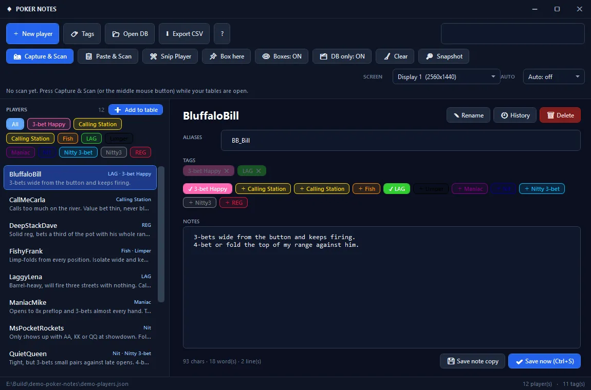

<div align="center">


# OpenPokerLab

**Free, open-source poker software and study tools. No account. No tracker. No paywall.**

This repository is the source of **[openpokerlab.org](https://openpokerlab.org)** - every page, style sheet and script that the site serves.

[](https://openpokerlab.org)
[](#-how-this-site-is-built)
[](https://github.com/NesloHub/OpenPokerLab-Website/stargazers)

</div>

---

## 🎯 What OpenPokerLab is

A small, independent project built on one idea: the software that helps you study poker should be free,
offline and readable - not another monthly subscription.

* **Desktop software** you unzip and run. Portable apps, no installer, no network calls.
* **Browser tools** that do the maths in your own browser: equity, ranges, bankroll and notes.
* **Study material** in plain language: a beginner's guide, a glossary and strategy guides.

---

## 🧰 Desktop software

| Tool | What it does | Download |
| --- | --- | --- |
| **[Poker Notes v2.1](https://openpokerlab.org/pokervision.html)** | Portable Windows notes app: notes, tags, aliases and note history for every player you meet, plus optional OCR screen capture, a click-through snip overlay and a click-through box. One self-contained EXE, one plain JSON database with atomic saves. | [PokerNotes_v2.1_Portable.zip](https://github.com/NesloHub/PokerNoteManager/releases/download/v2.1.0/PokerNotes_v2.1_Portable.zip) |
| **[PokerEquity Lab v1.0.0](https://openpokerlab.org/equity-lab.html)** | Windows equity and range calculator: 2 to 10 players, an exact or Monte Carlo engine and a 13x13 range matrix. | [PokerEquityLab-1.0.0-win-x64.zip](https://github.com/NesloHub/PokerEquityLab/releases/download/v1.0.0/PokerEquityLab-1.0.0-win-x64.zip) |
| **[PokerLab RNG v1.0](https://openpokerlab.org/pokerlab-rng.html)** | A small always-on-top Windows program that rolls a random number from 1 to 100 for GTO mixed frequencies. Set your frequency, roll, read the answer. | [PokerLab_RNG_v1.0.zip](https://github.com/NesloHub/PokerLabRNG/releases/download/v1.0.0/PokerLab_RNG_v1.0.zip) |

Every download lives on GitHub Releases, so the version numbers above always match the newest build.

---

## 🧮 Browser tools (nothing to install)

| Page | What it does |
| --- | --- |
| [Equity Calculator](https://openpokerlab.org/calculator.html) | Hand vs hand and hand vs range equity, right in the browser |
| [Preflop Ranges](https://openpokerlab.org/ranges.html) | Open, 3-bet and call ranges for every position |
| [Range Maker](https://openpokerlab.org/range-maker.html) | Build and read a 13x13 range in seconds |
| [Bankroll Calculator](https://openpokerlab.org/bankroll.html) | Variance, risk of ruin and buy-in planning |
| [Note Tool (web)](https://openpokerlab.org/notemanager.html) | Player notes in the browser - everything stays in your own LocalStorage |

---

## 📚 Learn

* **[Beginner's Guide](https://openpokerlab.org/beginner.html)** - from the first hand to a plan you can follow.
* **[Poker Glossary](https://openpokerlab.org/glossary.html)** - every term you will hear at the table, explained.
* **[Strategy Guides](https://openpokerlab.org/strategy.html)** - maths-based, exploitative play against the player types you actually meet.

## 👥 Community

* **[Streams & Creators](https://openpokerlab.org/content.html)** - the people worth watching and learning from.
* **[Poker Rooms & Rake](https://openpokerlab.org/sites.html)** - what the rooms charge and what you get for it.

---

## 📸 A look at Poker Notes



<sub>The screenshot uses a demo database and the nicknames are blurred.</sub>


## 🛠 How this site is built

No framework, no build step, no package manager - just files.

```
*.html          one file per page; the header and footer are written into the markup, so the
                whole navigation works with JavaScript switched off
style.css       the base theme (design tokens in :root, shared layout, cards and buttons)
style-v2.css    design v2: sticky glass header with dropdowns, new start page, richer footer,
                every rule scoped to body.v2 so it can only override what it means to
menu.js         the only script of the shell: mobile drawer, dropdown groups and the
                "you are here" highlight
fonts/ + fonts.css   self-hosted web fonts
avatars/        locally stored streamer avatars
_headers        security and cache headers (Cloudflare Pages)
sitemap.xml, robots.txt, 404.html, favicon.png, logo.png, og-image.png
```

**No analytics, no cookies, no third-party requests.** Every font, image and script is served from this
repository. The only page that stores anything is the web note tool, which keeps your notes in your own
browser (LocalStorage) and never sends them anywhere.

### Preview it locally

```bash
git clone https://github.com/NesloHub/OpenPokerLab-Website.git
cd OpenPokerLab-Website
python -m http.server 8080
# open http://localhost:8080
```

Opening `index.html` straight from disk works too; the small server is only nicer for absolute paths.

### Deploying

The site is hosted on **Cloudflare Pages**. Every push to `main` goes live within a minute or two, and
`_headers` takes care of security headers and caching for fonts, avatars and screenshots.

### One file is mirrored

`pokervision.html` also exists as `PokerVisionHUD_OpenPokerLab.html` in
[NesloHub/PokerNoteManager](https://github.com/NesloHub/PokerNoteManager) - the two files are kept byte
for byte identical, so an edit here has to be copied over there.

---

## 🤝 Contributing

OpenPokerLab grows on community contributions. Feedback, bug reports and pull requests are all welcome.

1. **Explore** - browse the repository; everything is plain HTML, CSS and JavaScript.
2. **Report** - found a bug, a typo or an idea? [Open an issue](https://github.com/NesloHub/OpenPokerLab-Website/issues).
3. **Contribute**:
   - Fork the project
   - Create your branch (`git checkout -b feature/AmazingFeature`)
   - Commit your changes (`git commit -m 'Add some AmazingFeature'`)
   - Push the branch (`git push origin feature/AmazingFeature`)
   - Open a Pull Request

Small, focused changes are the easiest to review - and please keep new pages in the same shape as the
existing ones (static header and footer, `style.css` + `style-v2.css`, no new dependencies).

---

## ⚠️ Disclaimer

OpenPokerLab is an independent, open-source educational project. We are not affiliated with, endorsed by
or sponsored by any poker room or software vendor mentioned on the site; all product names, logos and
brands belong to their respective owners. The software and the study material are provided "as is",
without warranty, and nothing here is financial advice. Check your poker room's terms of service before
running any third-party tool while playing.

**18+.** Please play responsibly. If you or someone you know has a gambling problem, seek help at
[GamblingTherapy.org](https://www.gamblingtherapy.org) or [GambleAware.org](https://www.gambleaware.org).

<div align="center">

<sub>Built with ❤️ by the OpenPokerLab community</sub>

</div>
